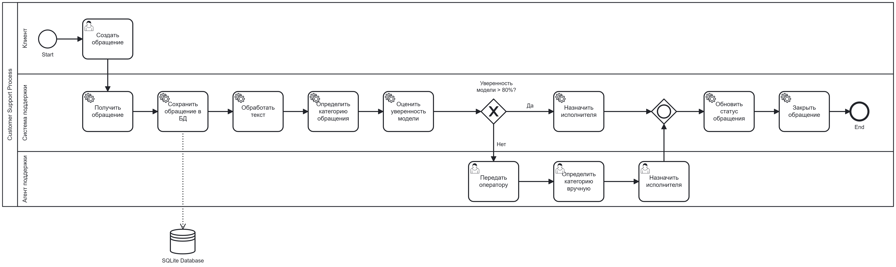

# Customer Support Analysis

Проект по анализу системы поддержки клиентов (Customer Support). Включает работу с синтетическим датасетом тикетов поддержки, SQL-базой данных, Exploratory Data Analysis (EDA), базовыми и продвинутыми запросами, а также ML-моделирование для классификации обращений.

## Структура проекта
```bash
Customer-support/
├── data/
│   ├── raw/
│   │   ├── customer_support_tickets.csv
│   │   └── complaints_processed.csv
│   └── processed/
│       └── customer_support.db
├── sql/
│   ├── create_tables.sql
│   ├── basic_queries.sql
│   └── advanced_queries.sql
├── notebooks/
│   ├── eda.ipynb
│   ├── support.ipynb
│   ├── basic_queries.ipynb
│   └── advanced_queries.ipynb
├── ML/
│   └── ML.ipynb
├── diagram.bpmn
└── README.md
```
Проект по анализу системы поддержки клиентов (Customer Support). Включает работу с синтетическим датасетом тикетов поддержки, SQL-базой данных, EDA, базовыми и продвинутыми запросами, а также ML для классификации обращений.

#### BPMN процесса обработки обращения

Диаграмма отражает полный жизненный цикл клиентского обращения: от создания пользователем до автоматической классификации и назначения исполнителя.




- **Основной датасет**: `customer_support_tickets.csv`
  - Информация о клиентах (имя, email, возраст, пол)
  - Продукты и типы тикетов
  - Метрики: приоритет, канал обращения, время первого ответа, время разрешения, удовлетворенность
  - Статусы и описания тикетов

- **Дополнительный датасет**: `complaints_processed.csv` — данные для задач NLP/ML (продукт + narrative).

## Основные возможности

### 1. База данных (SQLite)
- схема: `customers`, `products`, `ticket_types`, `tickets`
- Foreign keys для связей
- Готовые скрипты создания таблиц и наполнения данными

### 2. SQL-аналитика
- **Basic queries** — простые отчёты по каналам, приоритетам, продуктам, удовлетворенности
- **Advanced queries** — сложные аналитические запросы (оконные функции, CTE, агрегация и тд)

### 3. EDA
- Анализ распределений
- Временные метрики (resolution time)
- Взаимосвязи между продуктами, типами тикетов и удовлетворенностью
- Выявление аномалий в синтетических данных

### 4. Machine Learning
- Классификация обращений клиентов по продукту/категории (на основе `complaints_processed.csv`)
- Предобработка текста (очистка, токенизация)
- Обучение моделей (в ноутбуке `ML.ipynb`)
- Оценка качества

## Как запустить проект

1. **Клонируйте репозиторий**
   ```bash
   git clone https://github.com/sevavargin/Customer-support.git
   cd Customer-support

2. **Установите зависимости**
pip install pandas numpy matplotlib seaborn scikit-learn sqlite3 jupyter

3. **Создайте базу данных**
 Запустите notebook support.ipynb или выполните SQL-скрипты

4. **Запустите Juiter**


## Цели проекта

Освоить полный цикл анализа данных на Customer Support
Практика SQL (от простых к сложным запросам)
Работа с временными рядами и метриками поддержки (CSAT, FRT, TTR)
NLP/ML для автоматической категоризации обращений
Документирование бизнес-процессов (BPMN)


Технологии

Python: pandas, scikit-learn, matplotlib, seaborn
SQL: SQLite
Jupyter Notebooks
BPMN: диаграмма процессов

